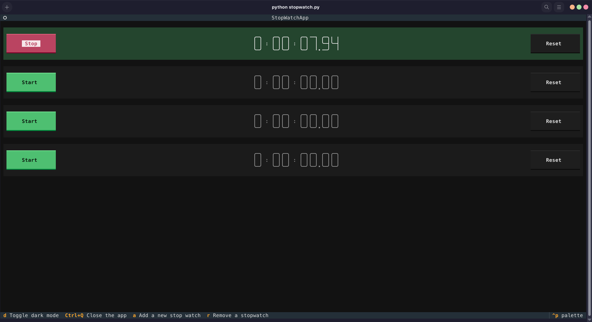

# Textual Stopwatch App


<br>


A terminal-based stopwatch application built using Python and the [Textual](https://github.com/Textualize/textual) framework. This app allows you to manage multiple stopwatches simultaneously with a clean, responsive TUI (Text User Interface).

## Features

* **Multiple Timers**: Add or remove stopwatch instances dynamically.
* **Precise Control**: Start, stop, and reset individual timers.
* **Responsive UI**: Custom styling for buttons and time displays defined in `stopwatch.tcss`.
* **Dark Mode**: Toggle between light and dark themes.

## Installation

1.  **Clone or download the repository.**
2.  **Install dependencies:**
    Ensure you have Python installed, then install the required packages listed in `requirements.txt`:

    ```bash
    pip install -r requirements.txt
    ```

## Usage

Run the application using Python:

```bash
python stopwatch.py